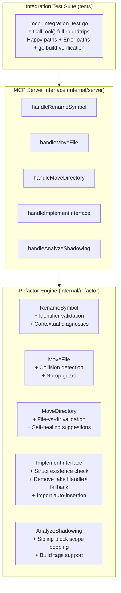

# Implementation Plan: MCP Integration Test Suite & Actionable Error Overhaul

Fix all issues identified in the integration test and error quality audit: eliminate silent failures, eliminate method hallucinations, fix scope-tracking bugs, upgrade MCP error messages to be self-healing and actionable for AI agents, and build a full-roundtrip MCP integration test suite.

---

## User Review Required

> [!IMPORTANT]
> **Behavioral Fix in `implement_interface`**:
> Previously, if `interface_name` could not be found, the tool silently generated a dummy `func (m *Struct) Handle<Interface>() error` stub and reported success. With this fix, `implement_interface` will strictly return an actionable error whenever an interface cannot be resolved. Similarly, if `struct_name` does not exist in `file_path`, it will return an error listing available structs instead of generating invalid stubs on a non-existent type.

> [!IMPORTANT]
> **Destination Overwrite Guard in `move_file`**:
> Previously, moving a file into a destination where a file with the same name already exists silently overwrote it. With this fix, `move_file` will return an error unless the user explicitly provides a unique `new_name`.

---

## Proposed Changes



---

### Component 1: `internal/refactor` (Engine Corrections)

#### [MODIFY] [`internal/refactor/impl_iface.go`](internal/refactor/impl_iface.go)
- **Struct Existence Check**: Scan `astFile.Decls` for `type <struct_name> struct`. If not found, collect all available struct names in the file and return:
  `struct "%s" not found in %s; available structs: [%s]`.
- **Prevent Empty Struct Name Panic**: Check `if strings.TrimSpace(opts.StructName) == ""` before accessing `opts.StructName[0]`.
- **Remove Fake `Handle<Iface>` Fallback**: Remove lines 117–124 from `resolveStubs`. Return an explicit error:
  `interface "%s" could not be resolved from standard library, current file, or workspace packages. Check spelling or imports.`
- **Auto-import Types**: Use `WriteASTFileWithImports` (with `ximports.Process`) so that methods referencing external types (e.g. `http.ResponseWriter`) automatically get required imports.

#### [MODIFY] [`internal/refactor/move_file.go`](internal/refactor/move_file.go)
- **No-Op Guard**: If both `opts.DestDir == ""` and `opts.NewName == ""`, return an error:
  `at least one of 'dest_dir' or 'new_name' is required to move or rename a file`.
- **Destination Collision Guard**: Check if `targetBaseName` (or companion test file) already exists in `absDestDir` before moving. Return:
  `destination file "%s" already exists; choose a different 'new_name' or remove the target file first`.

#### [MODIFY] [`internal/refactor/move_dir.go`](internal/refactor/move_dir.go)
- **File Detection**: If `source_dir` exists but is a file (`!info.IsDir()`), return:
  `source path "%s" is a file, not a directory; use 'move_file' instead`.
- **Source Equals Dest Guard**: If `absSource == absDest`, return an error indicating source and destination paths are identical.

#### [MODIFY] [`internal/refactor/rename.go`](internal/refactor/rename.go)
- **Identifier Validation**: Validate that `opts.To` is a valid Go identifier using `token.IsIdentifier(opts.To)` and `!token.Lookup(opts.To).IsKeyword()`. If invalid, return:
  `target name "%s" is not a valid Go identifier (must start with a letter/underscore and cannot be a Go keyword)`.
- **Rich Context on Symbol Not Found**: If symbol is not found, report how many packages were searched, whether `opts.File` was used, and hint that unexported symbols require specifying `file`.

#### [MODIFY] [`internal/refactor/shadow.go`](internal/refactor/shadow.go)
- **Fix Sibling Block Scope Popping**: Replace flat `ast.Inspect` in `inspectFileShadowing` with a recursive AST walk or dual-pass visitor so that upon exiting an `*ast.BlockStmt` (or `*ast.IfStmt` / `*ast.ForStmt`), the scope is properly popped with `popScope()`.
- **Build Tags Support**: Update `AnalyzeShadowing` to accept optional `buildTags string`.

---

### Component 2: `internal/server` (MCP Handlers & Error Actionability)

#### [MODIFY] [`internal/server/server.go`](internal/server/server.go)
- **Input Validation**: Add fast, helpful validation in each handler:
  - `handleRenameSymbol`: Ensure `directory`, `from`, `to` are non-empty.
  - `handleMoveFile`: Ensure `source_file` is non-empty and has a `.go` extension. Ensure at least one of `dest_dir` or `new_name` is non-empty.
  - `handleMoveDirectory`: Ensure both `source_dir` and `dest_dir` are non-empty.
  - `handleImplementInterface`: Ensure `file_path`, `struct_name`, `interface_name` are non-empty.
  - `handleAnalyzeShadowing`: Extract `build_tags` and pass to `refactor.AnalyzeShadowing(targetPath, buildTags)`.
- **Actionable Error Formatting**: Wrap all error returns with clear remediation suggestions so AI agents understand immediately how to adjust their tool calls.

---

### Component 3: Integration Tests (`tests/`)

#### [NEW] [`tests/mcp_integration_test.go`](tests/mcp_integration_test.go)
Implement full roundtrip MCP tests using `server.NewServer()` and `s.CallTool(ctx, req)`:
1. **Happy Paths**:
   - `rename_symbol`: module-wide rename via MCP tool call, verifying `go build ./...` succeeds.
   - `rename_symbol`: with `file` filter and with `offset` parameter.
   - `move_file`: move file to new directory via MCP tool call, verifying imports & package clause.
   - `move_file`: rename file in-place (`new_name`).
   - `move_file`: move and rename simultaneously.
   - `move_directory`: move package tree, verifying workspace import rewriting and `go build ./...`.
   - `implement_interface`: stdlib interface (`io.Reader`, `http.Handler`) on a real struct, verifying missing imports are added and code compiles.
   - `analyze_shadowing`: detect actual shadowing in a test file via MCP tool call.
2. **Actionable Error & Edge Case Paths**:
   - `rename_symbol`: invalid Go identifier (e.g. `var` or `123bad`) returns actionable error.
   - `rename_symbol`: missing required parameter returns descriptive error.
   - `move_file`: passing a directory returns `"source path is a directory, use move_directory instead"`.
   - `move_file`: destination file exists returns collision error.
   - `move_file`: neither `dest_dir` nor `new_name` provided returns clear error.
   - `move_directory`: passing a file returns `"use move_file instead"`.
   - `implement_interface`: non-existent struct returns available structs hint.
   - `implement_interface`: non-existent interface returns resolution error (no fake `HandleX`).
   - `implement_interface`: empty `struct_name` returns validation error without panicking.
   - `analyze_shadowing`: sibling blocks with same variable name do not trigger false positive shadowing.

#### [MODIFY] [`tests/shadow_analysis_test.go`](tests/shadow_analysis_test.go)
- Add real assertions checking that true shadowed variables are detected, and sibling blocks are not falsely flagged.

---

## Verification Plan

### Automated Tests
Execute all standard repository verification checks:
```bash
# 1. Run all unit & integration tests
go test -v ./...

# 2. Run linter verification
golangci-lint run

# 3. Run security analysis
gosec ./...

# 4. Run vulnerability audit
govulncheck ./...
```

### Manual / Integration Verification
- Verify that every tool can be invoked through `server.NewServer()` and `mcp.CallToolRequest`.
- Verify that all error messages contain concrete, actionable recommendations for AI agents.
- Verify `git status` is clean with all commits following Conventional Commits.
