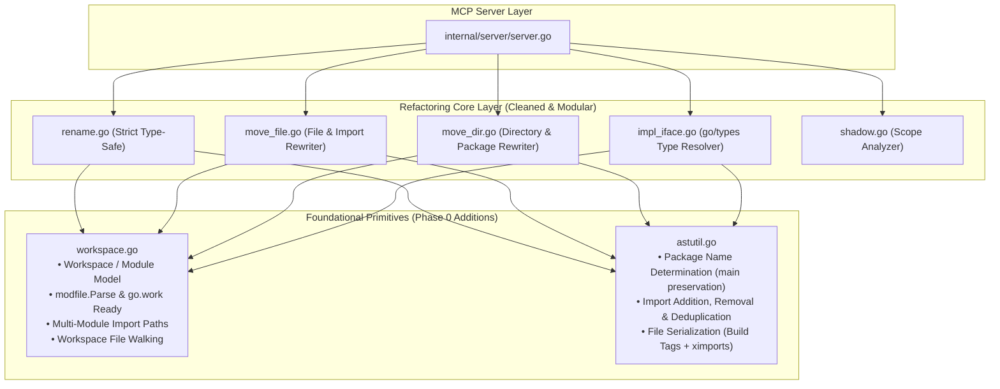

# Phase 0 Architectural Refactoring Plan: Robust Core Foundations

## Goal Description
Refactor the internal architecture of `go-refactor-mcp` to establish a cohesive, idiomatic Go foundation before implementing Category 1 (`go.work`, multi-module monorepos, third-party interface resolution) and Category 2 (cross-platform matrix) features.

This refactoring eliminates "vibe-coding" technical debt, replaces regex-based module parsing with official Go tooling (`golang.org/x/mod/modfile`), introduces unified `Workspace` and `astutil` abstractions, resolves 5 existing bugs (including `package main` destruction during directory moves and blind rename fallbacks), and ensures 100% test coverage and quality gate compliance.

---

## User Review Required

> [!IMPORTANT]
> **Zero Breaking Changes to MCP Tool Interface**: All 5 existing MCP tools (`rename_symbol`, `move_file`, `move_directory`, `implement_interface`, `analyze_shadowing`) retain their exact parameter names, schemas, and behavior. All existing 19 integration test suites will continue to pass.

> [!NOTE]
> **Bug Fixes Included in Phase 0**:
> 1. **`move_directory` destroying `package main`**: Moving a CLI binary directory (e.g. `cmd/app`) will now preserve `package main` instead of forcibly renaming it to `package app`.
> 2. **Fragile `go.mod` regex replaced**: Switched to `golang.org/x/mod/modfile.Parse`, preventing crashes on quoted or commented module definitions.
> 3. **Blind rename fallback prevented**: `rename_symbol` will return a descriptive error if the target symbol cannot be resolved by the type checker, rather than blindly renaming all identically named variables across the module.
> 4. **Unified AST file formatting**: Centralized file writing ensuring `//go:build` tags are preserved and imports are tidied via `ximports.Process`.
> 5. **Cleaned dead code**: Removed obsolete `CamelToSnake` utility.

---

## Open Questions

None. The scope is strictly bounded to internal restructuring and bug fixes while preserving external MCP compatibility.

---

## Architecture Blueprint



---

## Proposed Changes

### Foundational Primitives

#### [NEW] `internal/refactor/workspace.go`
Introduce a centralized `Workspace` and `ModuleInfo` domain abstraction:
- Detects the module or workspace root from any path.
- Robustly parses `go.mod` via `golang.org/x/mod/modfile.Parse` (prepares the exact hook for `modfile.ParseWork` in Phase 1).
- Provides helper methods:
  - `FindWorkspace(startDir string) (*Workspace, error)`
  - `ModuleForPath(absPath string) (*ModuleInfo, error)`
  - `CalculateImportPath(absDir string) (string, error)`
  - `WalkGoFiles(fn func(path string, mod *ModuleInfo) error) error`
  - `LoadPackages(tags []string) ([]*packages.Package, error)`
- Consolidates build tag discovery (`DiscoverWorkspaceBuildTags`).

#### [NEW] `internal/refactor/astutil.go`
Consolidate all AST inspection and manipulation routines:
- `DeterminePackageName(dirPath string, defaultName string) string`: Inspects existing `.go` files in `dirPath`. If existing files use `package main`, it preserves `main`.
- `WriteASTWithBuildTags(fset *token.FileSet, fileAST *ast.File, origContent string, destPath string) error`: Standardizes writing formatted Go code, preserving build tags.
- `WriteASTFile(fset *token.FileSet, fileAST *ast.File, destPath string) error`: Standardizes AST serialization.
- `WriteASTFileWithImports(fset *token.FileSet, fileAST *ast.File, destPath string) error`: Standardizes AST serialization with `ximports`.
- Import helpers: `FindImportSpec`, `AddImportSpec`, `RemoveImportSpec`, `HasImport`, `GetImportAlias`.

---

### Core Refactoring Tools

#### [MODIFY] `internal/refactor/types.go`
- Remove dead code `CamelToSnake`.
- Delegate `FindModuleRoot`, `GetModuleName`, and `LoadModulePackagesWithTags` to `Workspace` methods, keeping backwards-compatible package-level functions for existing tests.
- Retain `ShadowIssue`, `ParseBuildTags`, `IsVendorPath`, `ExtractBuildTags`, and `ParseAST`.

#### [MODIFY] `internal/refactor/move_dir.go`
- Replace raw string-based regex module calculations with `workspace.CalculateImportPath`.
- Fix Bug 1: Use `astutil.DeterminePackageName` instead of `cleanDirPackageName` so `package main` commands are preserved upon move.
- Replace manual `filepath.Walk` with `workspace.WalkGoFiles`.
- Standardize AST writes with `astutil.WriteASTFile`.

#### [MODIFY] `internal/refactor/move_file.go`
- Replace inlined module lookup and import calculations with `Workspace` methods.
- Eliminate duplicated import helper functions (`findImportSpec`, `addImportSpec`, `removeImportSpec`, `hasImport`, `getImportAlias`) in favor of `astutil`.
- Remove the linter-evasion split `rewriteUnprefixedNodePart1` / `rewriteUnprefixedNodePart2`, restructuring the AST rewriting into a clean visitor pattern that satisfies `gocyclo`.
- Retain cycle detection logic, connecting it directly to `workspace.LoadPackages`.

#### [MODIFY] `internal/refactor/rename.go`
- Fix Bug 3: Remove the dangerous blind string fallback where `targetObj == nil` mutates random identifiers. Return a descriptive error when a symbol cannot be resolved.
- Use `astutil.WriteASTFile` for consistent formatting.
- Simplify `RenameSymbol` by delegating package loading to `workspace.LoadPackages`.

#### [MODIFY] `internal/refactor/impl_iface.go`
- Refactor interface method resolution to use `go/types` and `packages.Load`:
  - When given standard interfaces (e.g. `io.Reader`, `fmt.Stringer`, `http.Handler`), resolve method signatures from `types.Interface`.
  - Seamlessly resolve user-defined local interfaces and external package interfaces.
- Standardize output formatting via `astutil.WriteASTFile`.

---

### Verification & Test Suite Additions

#### [NEW] `tests/move_directory_main_pkg_test.go`
- Verify that moving a directory containing `package main` (e.g., `cmd/server/main.go` -> `cmd/api/main.go`) preserves `package main` and doesn't rename it to `package api`.

#### [NEW] `tests/workspace_modfile_robustness_test.go`
- Verify `Workspace` correctly parses `go.mod` containing comments, quotes, and whitespace.

#### [NEW] `tests/rename_symbol_safety_test.go`
- Verify that trying to rename a non-existent or unresolvable symbol returns an explicit error rather than blindly renaming identifiers.

#### [NEW] `tests/implement_interface_stdlib_test.go`
- Verify that standard library interfaces beyond the original 5 (e.g., `net/http.Handler` with `ServeHTTP(ResponseWriter, *Request)`) generate exact method stubs.

---

## Verification Plan

### Automated Quality Gates
All local verification steps mandated by repository rules will be executed in order:

1. **Unit Test Suite**:
   ```bash
   go test -v ./...
   ```
   *Requirement*: 100% pass across all packages (`github.com/joangrigorov/go-refactor-mcp`, `.../internal/server`, `.../tests`).

2. **Linter Verification**:
   ```bash
   golangci-lint run
   ```
   *Requirement*: 0 issues reported. All complexity (`gocyclo`, `cyclop`), shadowing (`govet`), and error checking linters must pass cleanly.

3. **Security Audit**:
   ```bash
   gosec ./...
   ```
   *Requirement*: 0 security issues.

4. **Vulnerability Audit**:
   ```bash
   govulncheck ./...
   ```
   *Requirement*: 0 known vulnerabilities.

### Manual Verification
- Test running the MCP CLI `--help` and `--version` flags.
- Verify that all 5 registered tools in `server.NewServer()` remain identical in name and signature.
