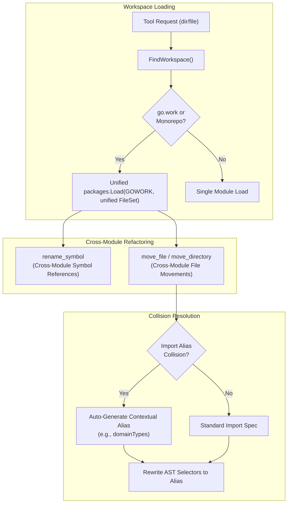

# Phase 1 Implementation Plan: Multi-Module (`go.work`), Cross-Module Refactoring & Import Collision Auto-Aliasing

## Goal Description
Build upon the Phase 0 architecture to deliver full support for **Category 1** Go setups:
1. **Multi-Module Workspaces (`go.work`) & Monorepos**: Seamless cross-module symbol renaming, package loading, and file/directory moves across all member modules.
2. **Cross-Module Refactoring**: Moving files and directories between separate Go modules in the same workspace while automatically updating module boundaries, import paths, and dependencies.
3. **Import Alias Collision Auto-Resolution (Edge Case A)**: Automatically detect package name collisions in target files (e.g. multiple packages named `types` or `errors`) and generate unique, contextual aliases (e.g. `domainTypes "example.com/domain/types"`) when rewriting selectors.
4. **Monorepo Discovery**: Auto-detect multi-module monorepos that contain multiple `go.mod` files even when a `go.work` file hasn't been explicitly created.

---

## User Review Required

> [!IMPORTANT]
> **Unified Cross-Module Type Analysis**:
> Cross-module symbol renaming across `go.work` requires a shared `token.FileSet` so type definitions in Module A and usages in Module B share identical coordinate scopes. `Workspace.LoadPackages` will be updated to use a unified `token.FileSet` and root `go.work` loader.

> [!NOTE]
> **Import Collision Protection**:
> When moving a file into a common package name (such as `types`, `models`, `errors`, `util`), existing target files that already import another package under that name will have the new import automatically aliased (e.g. `pkgTypes "..."`) to prevent Go compiler errors (`redeclared in this block`).

---

## Architecture Blueprint



---

## Proposed Changes

### Workspace & Package Loading

#### [MODIFY] `internal/refactor/workspace.go`
- **Unified `token.FileSet` & `go.work` Package Loading**:
  - Update `(ws *Workspace) LoadPackages` to share a single `token.FileSet` across all loaded packages.
  - When `ws.IsWork` is true, invoke `packages.Load` with `Dir: ws.Root` and `cfg.Fset = sharedFset` to allow `go/packages` to leverage Go's native `go.work` resolution across all workspace modules simultaneously.
- **Monorepo Auto-Discovery (without `go.work`)**:
  - In `searchWorkspaceRoots`, if no `go.work` exists but the directory tree under the root contains multiple `go.mod` sub-modules, register all discovered sub-modules into `ws.Modules` so cross-module file walking and import path calculations work out-of-the-box.

---

### Import Collision Resolution & Cross-Module Moves

#### [MODIFY] `internal/refactor/astutil.go`
- **Import Alias Conflict Detection**:
  - Add `ResolveUniqueImportAlias(fileAST *ast.File, newImportPath, preferredAlias string, exceptSpec *ast.ImportSpec) string`:
    - Inspects all existing imports in `fileAST.Imports`.
    - If `preferredAlias` is already used by a *different* import path, derive a disambiguated alias (e.g. using parent package name, or numeric suffix if needed).

#### [MODIFY] `internal/refactor/move_file.go`
- **Import Collision Integration**:
  - When `updateFileImportSpecsAndSelectors` or `updateSourcePackageFile` adds `newImportPath`, check if `newPkgName` conflicts with an existing import in `astFile`.
  - If a collision exists, generate an alias via `ResolveUniqueImportAlias`, assign it to `newSpec.Name`, and update all selector references (`id.Name = resolvedAlias`).
- **Cross-Module Move Validation**:
  - Correctly calculates destination module import paths and updates referencing files across all workspace modules.

#### [MODIFY] `internal/refactor/move_dir.go`
- **Cross-Module Directory Moves**:
  - Support moving a directory from one module root to another module root within the workspace.
  - Update import paths across all modules in the workspace.

#### [MODIFY] `internal/refactor/rename.go`
- **Cross-Module Symbol Renaming**:
  - With the unified `FileSet` in `Workspace.LoadPackages`, verify and ensure `sameObject` correctly matches symbol definitions in Module A with symbol usages in Module B across `go.work` workspaces.

---

## Verification Plan

### Automated Quality Gates
1. **Unit Test Suite**:
   ```bash
   go test -v ./...
   ```
   *Requirement*: 100% pass across all existing and new test suites.

2. **Linter Verification**:
   ```bash
   golangci-lint run
   ```
   *Requirement*: 0 issues reported.

3. **Security Audit**:
   ```bash
   gosec ./...
   ```
   *Requirement*: 0 security issues.

4. **Vulnerability Audit**:
   ```bash
   govulncheck ./...
   ```
   *Requirement*: 0 vulnerabilities in workspace code.
