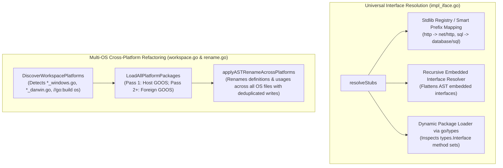

# Implementation Plan: Phase 2 - Universal Interface Resolution & Cross-Platform Refactoring

Extend `go-refactor-mcp` with Phase 2 capabilities:
1. **Dynamic Universal & Embedded Interface Resolution** in `implement_interface`: Resolve any standard library package (with smart prefix lookup), embedded interface hierarchies (`io.ReadCloser`, nested interfaces), and third-party dependencies via `go/types`.
2. **Cross-Platform / Multi-OS Symbol Refactoring** in `rename_symbol`: Detect foreign OS files (`*_windows.go`, `*_darwin.go`, `*_linux.go`, and `//go:build <os>`), execute multi-pass workspace package loading with `GOOS` target switching, and update symbol definitions and usages across all operating systems simultaneously.

---

## User Review Required

> [!IMPORTANT]
> **Multi-OS Build Isolation**:
> When a workspace contains platform-specific files (e.g. `_windows.go` on a Linux host), `packages.Load` will be executed in targeted secondary passes with `cfg.Env = append(os.Environ(), "GOOS=windows")`. This requires standard Go standard library source availability (present in all Go installations). Only detected target operating systems will trigger a secondary pass, keeping normal single-platform operations fast (0 extra overhead).

> [!NOTE]
> **Embedded Interface Method Flattening**:
> When an interface embeds other interfaces (e.g. `type MyService interface { io.Reader; CustomOp() }`), `implement_interface` will resolve and generate stubs for all methods across the entire embedding tree, preserving parameter names and multi-return signatures.

---

## Open Questions

- Should `implement_interface` support generic interfaces with explicit type parameters (e.g. `Container[T any]`)?
  *(Recommended: Yes, `go/types` automatically instantiates signatures when type arguments are provided, and generates generic stubs when used without arguments).*

---

## Proposed Changes



---

### Component 1: Universal & Embedded Interface Resolution (`internal/refactor/`)

#### [MODIFY] [`internal/refactor/impl_iface.go`](internal/refactor/impl_iface.go)
- **Stdlib Smart Prefix Resolver**:
  When an interface is specified with an unqualified or shorthand package prefix (e.g. `http.Handler`, `url.URL`, `sql.Scanner`, `driver.Valuer`, `json.Marshaler`), automatically map shorthand aliases to canonical standard library package paths (`net/http`, `net/url`, `database/sql`, `database/sql/driver`, `encoding/json`).
- **Embedded Interface Traversal**:
  Enhance `resolveLocalInterface` and workspace interface scanning to inspect embedded interface fields (`*ast.Ident` and `*ast.SelectorExpr`). Recursively resolve embedded interface methods and merge them into the final `MethodStub` list.
- **Deep `types.Interface` Method Set Extraction**:
  In `extractInterfaceStubsFromType`, traverse all explicit and embedded methods via `itype.NumMethods()` and `itype.Method(i)`, formatting parameter and return types with appropriate package qualification.
- **Auto-import Missing Packages**:
  Ensure `WriteASTFileWithImports` adds imports for external types referenced in generated method signatures.

---

### Component 2: Cross-Platform / Multi-OS Support (`internal/refactor/`)

#### [MODIFY] [`internal/refactor/workspace.go`](internal/refactor/workspace.go)
- **Platform Discovery (`DiscoverWorkspacePlatforms`)**:
  Walk workspace Go files to detect platform-specific file naming suffixes (`*_windows.go`, `*_darwin.go`, `*_linux.go`, `*_freebsd.go`, `*_openbsd.go`, etc.) and `//go:build <os>` directives.
  Return a deduplicated list of foreign operating systems that differ from `runtime.GOOS`.
- **Multi-Platform Package Loading (`LoadAllPlatformPackages`)**:
  - Pass 1: Load packages using host `runtime.GOOS`.
  - Pass 2+: For each detected foreign OS, configure `packages.Config` with `cfg.Env = append(os.Environ(), "GOOS="+targetOS)` and load packages.
  - Return combined package list covering all target operating systems.

#### [MODIFY] [`internal/refactor/rename.go`](internal/refactor/rename.go)
- **Multi-Platform Symbol Matching**:
  `RenameSymbol` loads packages using `LoadAllPlatformPackages`.
  Matches `targetObj` across all platform passes (whether declared in shared files or platform-specific files).
  Applies `applyASTRename` across all platform ASTs.
- **Deduplicated Disk Writing**:
  Track `writtenFiles := make(map[string]bool)` so shared files evaluated across multiple platform passes are only written once.

#### [MODIFY] [`internal/refactor/move_file.go`](internal/refactor/move_file.go)
- Ensure companion file collection detects and handles platform-specific test companions (e.g. `service_windows_test.go` companion to `service_windows.go`).

---

### Component 3: Integration Tests (`tests/`)

#### [NEW] [`tests/cross_platform_rename_test.go`](tests/cross_platform_rename_test.go)
- Create a test workspace with multi-OS files:
  - `runner.go`: calls `InitPlatform()`
  - `runner_linux.go`: defines `func InitPlatform() string { return "linux" }`
  - `runner_windows.go`: defines `func InitPlatform() string { return "windows" }`
  - `runner_darwin.go`: defines `func InitPlatform() string { return "darwin" }`
- Call `rename_symbol` through MCP server to rename `InitPlatform` to `InitializePlatform`.
- **MCP Tool Call Happy Path**:
  - Create a test workspace with multi-OS files:
    - `runner.go`: calls `InitPlatform()`
    - `runner_linux.go`: defines `func InitPlatform() string { return "linux" }`
    - `runner_windows.go`: defines `func InitPlatform() string { return "windows" }`
    - `runner_darwin.go`: defines `func InitPlatform() string { return "darwin" }`
  - Call `rename_symbol` through `server.NewServer()` to rename `InitPlatform` to `InitializePlatform`.
  - Assert that `runner.go`, `runner_linux.go`, `runner_windows.go`, and `runner_darwin.go` are **all updated**.
  - **Tri-Platform Compiler Verification**:
    - `GOOS=linux go build ./...` passes.
    - `GOOS=windows go build ./...` passes.
    - `GOOS=darwin go build ./...` passes.
- **Actionable Error & Edge Case Paths**:
  - Symbol defined only in Windows file when running on Linux -> successfully found and renamed across Windows files.
  - Platform file containing syntax error -> actionable error explaining which platform file failed to load.

#### [NEW] [`tests/embedded_interface_test.go`](tests/embedded_interface_test.go)
- **MCP Tool Call Happy Path**:
  - Create local interface hierarchy:
    ```go
    type Reader interface { Read(p []byte) (n int, err error) }
    type Closer interface { Close() error }
    type ReadCloser interface { Reader; Closer; Reset() error }
    ```
  - Call `implement_interface` for `ReadCloser` via `s.GetTool("implement_interface").Handler()`.
  - Verify method stubs for all 3 methods (`Read`, `Close`, `Reset`) are generated on the struct.
  - Assert post-refactor `go build ./...` succeeds cleanly.
- **Embedded Stdlib Interface**:
  - Struct implementing `type CustomStream interface { io.ReadCloser; Flush() error }`.
  - Verify all 3 methods (`Read`, `Close`, `Flush`) are generated and required `io` imports are added.
- **Actionable Error Paths**:
  - Local interface embedding an undefined type -> actionable error indicating which embedded interface failed to resolve.

#### [NEW] [`tests/third_party_interface_test.go`](tests/third_party_interface_test.go)
- **MCP Tool Call Happy Path**:
  - Standard library interface with shorthand prefix: `http.Handler` in a file that does not yet import `net/http`.
  - Verify `ServeHTTP(http.ResponseWriter, *http.Request)` is generated.
  - Verify `net/http` is automatically imported via `WriteASTFileWithImports`.
  - Verify `go build ./...` compiles cleanly.
- **Actionable Error Paths**:
  - Non-existent package path (e.g. `invalid/pkg.MyIface`) -> actionable error: `"interface 'invalid/pkg.MyIface' could not be resolved from standard library, current file, or workspace packages"`.
  - Non-interface type in package (e.g. attempting to implement a struct or func) -> actionable error explaining target is not an interface.

---

## Testing Rigor & Quality Matrix

| Quality Criterion | How It Is Guaranteed in Phase 2 |
|---|---|
| **MCP Layer Testing** | 100% of new test scenarios execute through `server.NewServer()` and `s.GetTool().Handler()` with `CallToolRequest`, ensuring argument parsing, validation, and JSON result formatting are fully exercised. |
| **Real Compilation Verification** | Every single happy-path test executes `go build ./...` after refactoring. For cross-platform tests, it verifies multi-platform compilation across `GOOS=linux`, `GOOS=windows`, and `GOOS=darwin`. |
| **Actionable Error Diagnostics** | Every negative path asserts that errors contain actionable remediation hints (e.g. candidate suggestions, specific parameter names, unresolvable package details) rather than generic error strings. |
| **Strict Quality Gates** | Must pass `go test -v ./...` (100% pass), `golangci-lint run` (0 issues), `gosec ./...` (0 issues), and `govulncheck ./...`. |

---

## Verification Plan

### Automated Tests
```bash
# 1. Run full unit and integration test suite
go test -v ./...

# 2. Run linter verification
golangci-lint run

# 3. Run security analysis
gosec ./...

# 4. Run vulnerability check
govulncheck ./...
```

### Manual Verification
- Verify cross-platform symbol renaming updates `_windows.go` and `_darwin.go` files even when running on Linux host.
- Verify embedded interfaces generate complete method sets without omissions.
- Verify git status is clean and all commits adhere to Conventional Commits.
